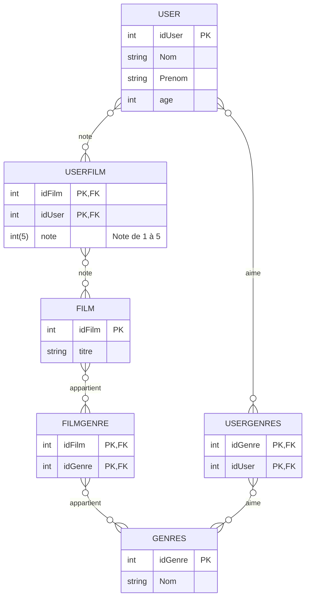

```mermaid

erDiagram
    FILM }o--o{ FILMGENRE : appartient
    FILMGENRE }o--o{ GENRES : appartient
    FILM {
        int idFilm PK
        string titre

    }
    USER }o--o{ USERFILM : note

    USERFILM }o--o{ FILM : note
    USER {
        int idUser PK
        string Nom
        string Prenom
        int age
    }
    USER }o--o{ USERGENRES : aime
    USERGENRES }o--o{ GENRES : aime


    GENRES {
        int idGenre PK
        string Nom
    }
    USERGENRES {
        int idGenre PK, FK
        int idUser PK, FK

    }

    USERFILM {
        int idFilm PK, FK
        int idUser PK, FK
        int(5) note "Note de 1 à 5"
    }

    FILMGENRE {
        int idFilm PK, FK
        int idGenre PK, FK
    }


```
