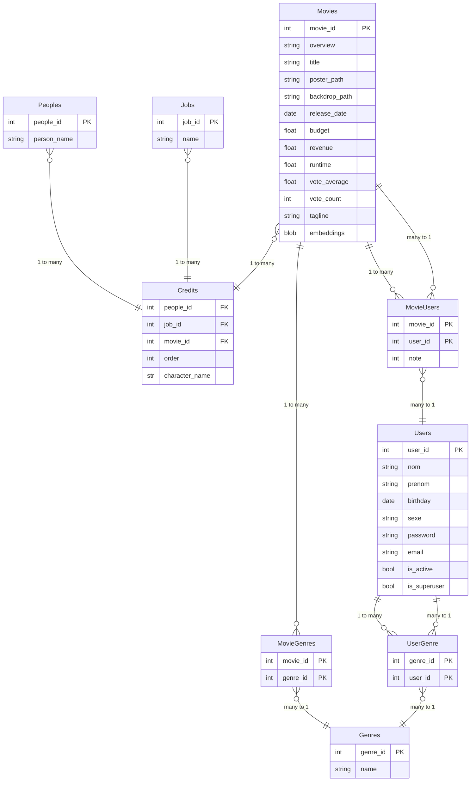

```mermaid

erDiagram
    Movies {
        int movie_id PK
        string overview
        string title
        string poster_path
        string backdrop_path
        date release_date
        float budget
        float revenue
        float runtime
        float vote_average
        int vote_count
        string tagline
        blob embeddings

    }
    Peoples {
        int people_id PK
        string person_name
    }
    Jobs {
        int job_id PK
        string name
    }
    Credits{
        int people_id FK
        int job_id FK
        int movie_id FK
        int order
        str character_name
    }
    Genres {
        int genre_id PK
        string name
    }
    MovieGenres {
        int movie_id PK
        int genre_id PK
    }
    Users {
        int user_id PK
        string nom
        string prenom
        date birthday
        string sexe
        string password
        string email
        bool is_active
        bool is_superuser

    }
    MovieUsers {
        int movie_id PK
        int user_id PK
        int note
    }
    UserGenre {
        int genre_id PK
        int user_id PK
    }


    Movies ||--o{ MovieGenres: "1 to many"
    MovieGenres }o--|| Genres: "many to 1"
    Peoples }o--|| Credits : "1 to many"
    Jobs }o--|| Credits : "1 to many"
    Movies }o--|| Credits : "1 to many"
    MovieUsers }o--|| Movies: "many to 1"
    MovieUsers }o--|| Users: "many to 1"
    Users ||--o{ UserGenre: "1 to many"
    UserGenre }o--|| Genres: "many to 1"
    UserGenre }o--|| Users: "many to 1"
    Movies ||--o{ MovieUsers: "1 to many"
```