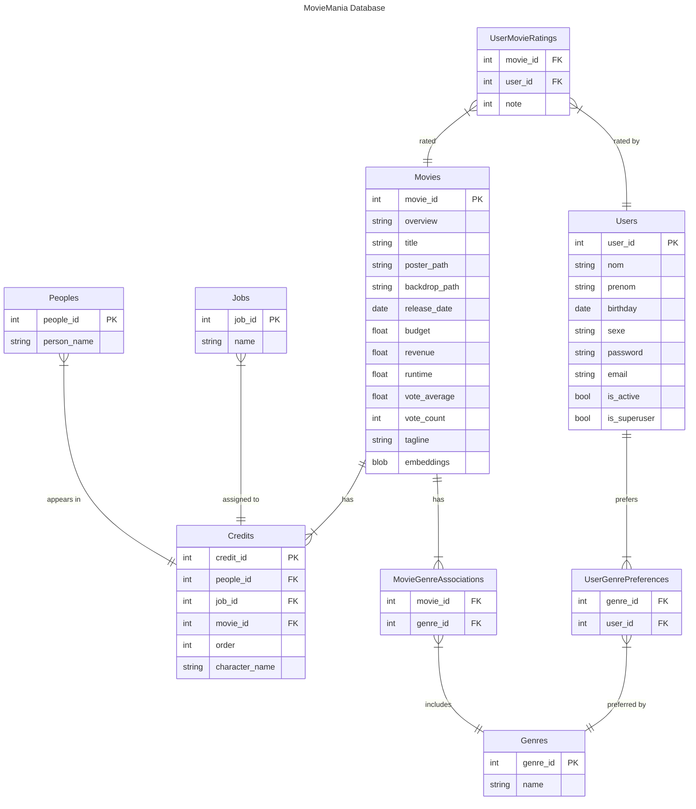

```mermaid
---
title: MovieMania Database
---

erDiagram
    Movies {
        int movie_id PK
        string overview
        string title
        string poster_path
        string backdrop_path
        date release_date
        float budget
        float revenue
        float runtime
        float vote_average
        int vote_count
        string tagline
        blob embeddings
    }
    Peoples {
        int people_id PK
        string person_name
    }
    Jobs {
        int job_id PK
        string name
    }
    Credits {
        int credit_id PK
        int people_id FK
        int job_id FK
        int movie_id FK
        int order
        string character_name
    }
    Genres {
        int genre_id PK
        string name
    }
    MovieGenreAssociations {
        int movie_id FK
        int genre_id FK
    }
    Users {
        int user_id PK
        string nom
        string prenom
        date birthday
        string sexe
        string password
        string email
        bool is_active
        bool is_superuser
    }
    UserMovieRatings {
        int movie_id FK
        int user_id FK
        int note
    }
    UserGenrePreferences {
        int genre_id FK
        int user_id FK
    }

    Movies 1--many(1) MovieGenreAssociations : "has"
    MovieGenreAssociations many(1)--1 Genres : "includes"
    Peoples many(1)--1 Credits : "appears in"
    Jobs many(1)--1 Credits : "assigned to"
    Movies 1--many(1) Credits : "has"
    UserMovieRatings many(1)--1 Movies : "rated"
    UserMovieRatings many(1)--1 Users : "rated by"
    Users 1--many(1) UserGenrePreferences : "prefers"
    UserGenrePreferences many(1)--1 Genres : "preferred by"
```
