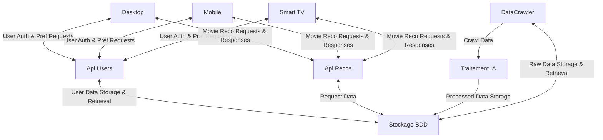

```mermaid
graph TD
    A[Mobile]
    B[Desktop]
    I[Smart TV]
    C[Api Users]
    D[Api Recos]
    E[DataCrawler]
    G[Traitement IA]
    H[Stockage BDD]
    B & A & I <--> |User Auth & Pref Requests| C
    B & A & I <--> |Movie Reco Requests & Responses| D
    C <--> |User Data Storage & Retrieval| H
    D <--> |Request Data| H
    E --> |Crawl Data| G
    G --> |Processed Data Storage| H
    E <--> |Raw Data Storage & Retrieval| H
```
