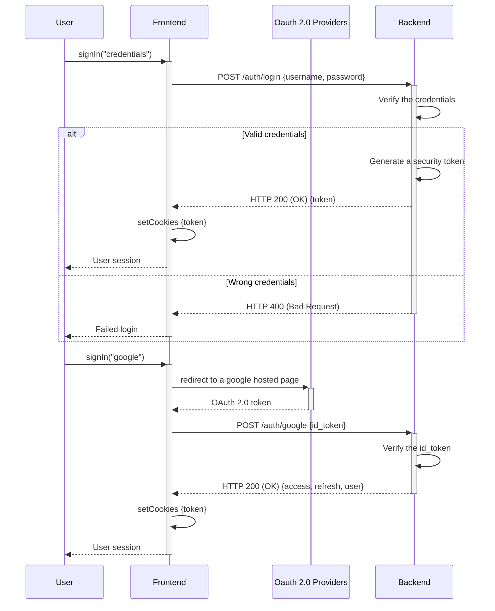

### Login Sequence Diagram

```mermaid
sequenceDiagram
    participant User
    participant Frontend
    participant Oauth 2.0 Providers
    participant Backend

    User->>+Frontend: signIn("credentials")
    Frontend->>+Backend: POST /auth/login {username, password}
    Backend->>Backend: Verify the credentials
    alt Valid credentials
        Backend->>Backend: Generate a security token
        Backend-->>Frontend: HTTP 200 (OK) {token}
        Frontend->>Frontend: setCookies {token}
        Frontend-->>User: User session
    else Wrong credentials
        Backend-->>-Frontend: HTTP 400 (Bad Request)
        Frontend-->>-User: Failed login
    end

    User->>+Frontend: signIn("google")
    Frontend->>+Oauth 2.0 Providers: redirect to a google hosted page
    Oauth 2.0 Providers-->>-Frontend: OAuth 2.0 token
    Frontend->>+Backend: POST /auth/google {id_token}
    Backend->>Backend: Verify the id_token
    Backend-->>-Frontend: HTTP 200 (OK) {access, refresh, user}
    Frontend->>Frontend: setCookies {token}
    Frontend-->>-User: User session
```
<>