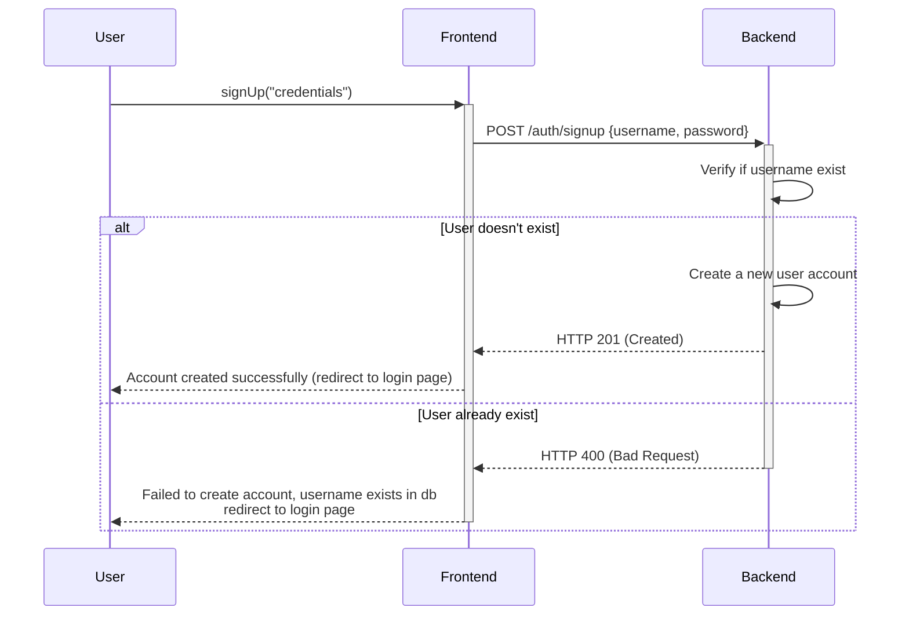

### SignUp Sequence Diagram

```mermaid
sequenceDiagram
    participant User
    participant Frontend
    participant Backend

    User->>+Frontend: signUp("credentials")
    Frontend->>+Backend: POST /auth/signup {username, password}
    Backend->>Backend: Verify if username exist
    alt User doesn't exist
        Backend->>Backend: Create a new user account
        Backend-->>Frontend: HTTP 201 (Created)
        Frontend-->>User: Account created successfully (redirect to login page)
    else User already exist
        Backend-->>-Frontend: HTTP 400 (Bad Request)
        Frontend-->>-User: Failed to create account, username exists in db <br> redirect to login page
    end
```