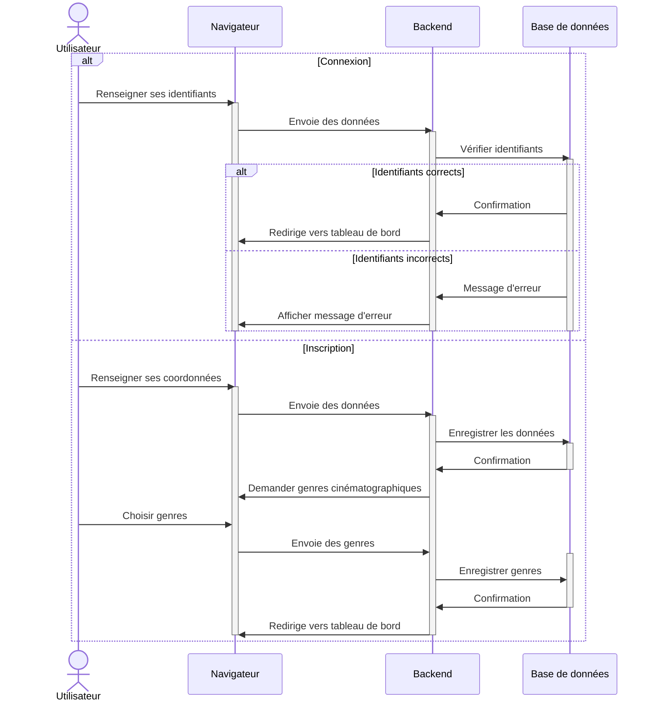

```mermaid
sequenceDiagram
    actor Utilisateur
    participant Navigateur
    participant Controleur as Backend
    participant Entite as Base de données

    alt Connexion
        Utilisateur ->> Navigateur: Renseigner ses identifiants
        activate Navigateur
        Navigateur ->> Controleur: Envoie des données
        activate Controleur
        Controleur ->> Entite: Vérifier identifiants
        activate Entite
        alt Identifiants corrects
            Entite ->> Controleur: Confirmation
            Controleur ->> Navigateur: Redirige vers tableau de bord
        else Identifiants incorrects
            Entite ->> Controleur: Message d'erreur
            Controleur ->> Navigateur: Afficher message d'erreur
        end
        deactivate Entite
        deactivate Controleur
        deactivate Navigateur
    else Inscription
        Utilisateur ->> Navigateur: Renseigner ses coordonnées
        activate Navigateur
        Navigateur ->> Controleur: Envoie des données
        activate Controleur
        Controleur ->> Entite: Enregistrer les données
        activate Entite
        Entite ->> Controleur: Confirmation
        deactivate Entite
        Controleur ->> Navigateur: Demander genres cinématographiques
        Utilisateur ->> Navigateur: Choisir genres
        Navigateur ->> Controleur: Envoie des genres
        activate Entite
        Controleur ->> Entite: Enregistrer genres
        Entite ->> Controleur: Confirmation
        deactivate Entite
        Controleur ->> Navigateur: Redirige vers tableau de bord
        deactivate Controleur
        deactivate Navigateur
    end
```