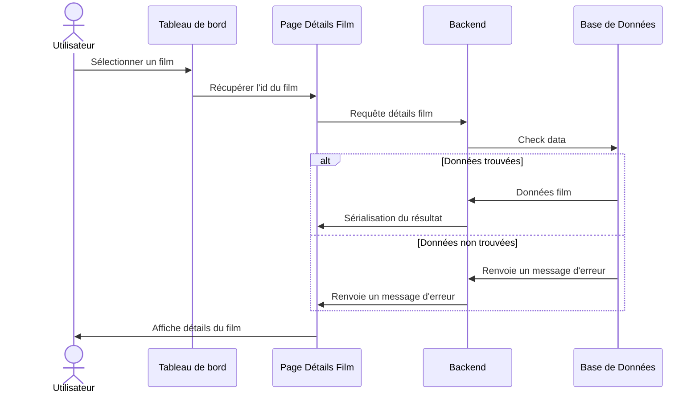

```mermaid
sequenceDiagram
    actor Utilisateur
    participant Dashboard as Tableau de bord
    participant Dialogue as Page Détails Film
    participant Controleur as Backend
    participant Entite as Base de Données

    Utilisateur ->> Dashboard: Sélectionner un film
    Dashboard ->> Dialogue: Récupérer l'id du film
    Dialogue ->> Controleur: Requête détails film
    Controleur ->> Entite: Check data
    alt Données trouvées
        Entite ->> Controleur: Données film
        Controleur ->> Dialogue: Sérialisation du résultat
    else Données non trouvées
        Entite ->> Controleur: Renvoie un message d'erreur
        Controleur ->> Dialogue: Renvoie un message d'erreur
    end
    Dialogue ->> Utilisateur: Affiche détails du film
```