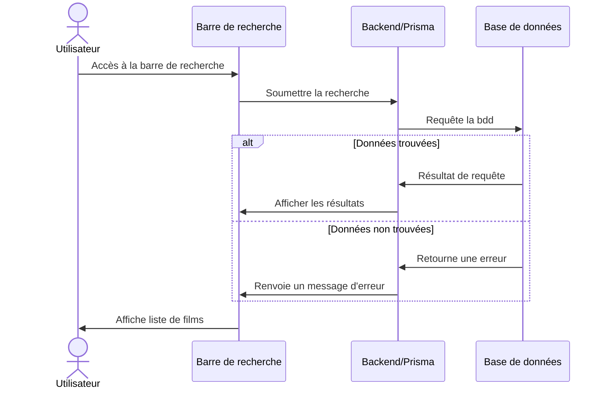

```mermaid
sequenceDiagram
    actor Utilisateur
    participant Dialogue as Barre de recherche
    participant Controleur as Backend/Prisma
    participant Entite as Base de données

    Utilisateur ->> Dialogue: Accès à la barre de recherche
    Dialogue ->> Controleur: Soumettre la recherche
    Controleur ->> Entite: Requête la bdd
    alt Données trouvées
        Entite ->> Controleur: Résultat de requête
        Controleur ->> Dialogue: Afficher les résultats
    else Données non trouvées
        Entite ->> Controleur: Retourne une erreur
        Controleur ->> Dialogue: Renvoie un message d'erreur
    end
    Dialogue ->> Utilisateur: Affiche liste de films
```

