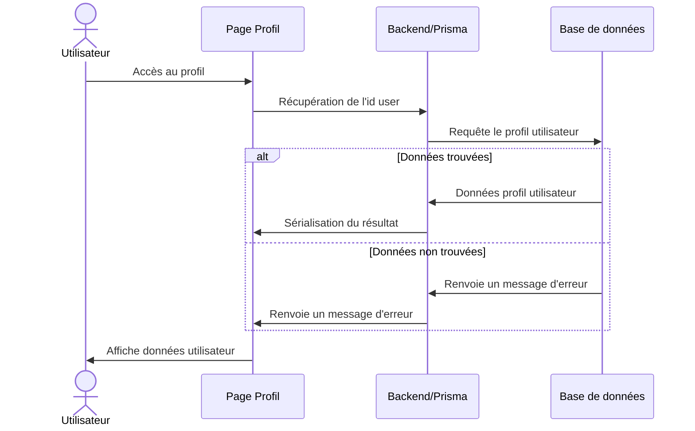

```mermaid
sequenceDiagram
    actor Utilisateur
    participant Dialogue as Page Profil
    participant Controleur as Backend/Prisma
    participant Entite as Base de données

    Utilisateur ->> Dialogue: Accès au profil
    Dialogue ->> Controleur: Récupération de l'id user
    Controleur ->> Entite: Requête le profil utilisateur
    alt Données trouvées
        Entite ->> Controleur: Données profil utilisateur
        Controleur ->> Dialogue: Sérialisation du résultat
    else Données non trouvées
        Entite ->> Controleur: Renvoie un message d'erreur
        Controleur ->> Dialogue: Renvoie un message d'erreur
    end
    Dialogue ->> Utilisateur: Affiche données utilisateur
```