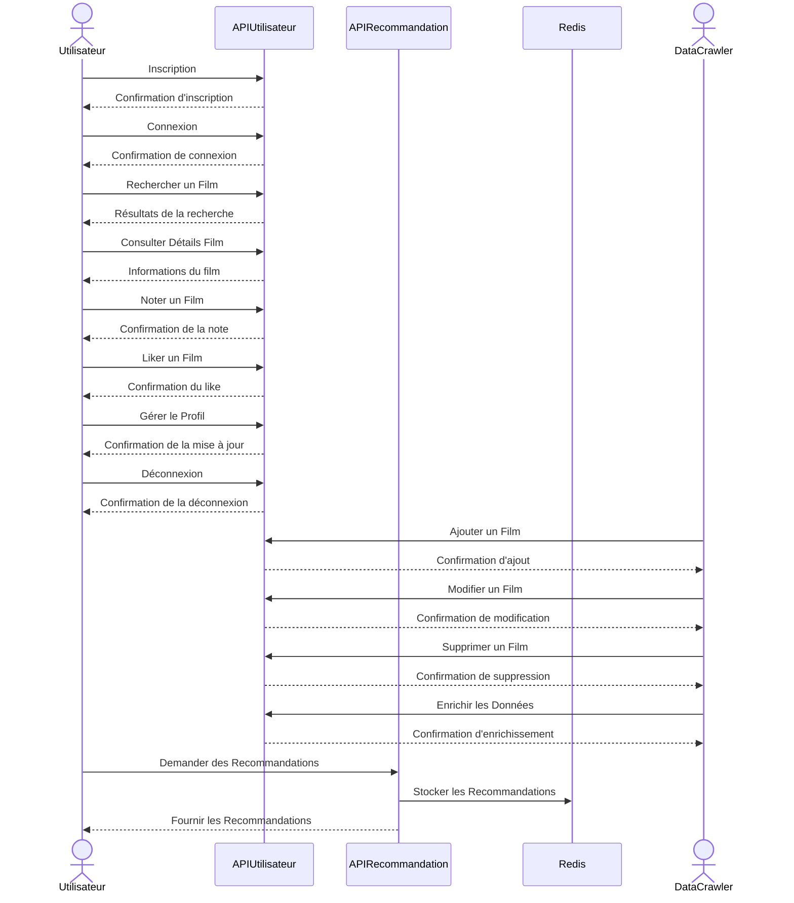

```mermaid

sequenceDiagram
  actor Utilisateur
  participant APIUtilisateur
  participant APIRecommandation
  participant Redis
  actor DataCrawler

  Utilisateur ->> APIUtilisateur: Inscription
  APIUtilisateur -->> Utilisateur: Confirmation d'inscription
  
  Utilisateur ->> APIUtilisateur: Connexion
  APIUtilisateur -->> Utilisateur: Confirmation de connexion
  
  Utilisateur ->> APIUtilisateur: Rechercher un Film
  APIUtilisateur -->> Utilisateur: Résultats de la recherche
  
  Utilisateur ->> APIUtilisateur: Consulter Détails Film
  APIUtilisateur -->> Utilisateur: Informations du film
  
  Utilisateur ->> APIUtilisateur: Noter un Film
  APIUtilisateur -->> Utilisateur: Confirmation de la note
  
  Utilisateur ->> APIUtilisateur: Liker un Film
  APIUtilisateur -->> Utilisateur: Confirmation du like
  
  Utilisateur ->> APIUtilisateur: Gérer le Profil
  APIUtilisateur -->> Utilisateur: Confirmation de la mise à jour
  
  Utilisateur ->> APIUtilisateur: Déconnexion
  APIUtilisateur -->> Utilisateur: Confirmation de la déconnexion
  
  DataCrawler ->> APIUtilisateur: Ajouter un Film
  APIUtilisateur -->> DataCrawler: Confirmation d'ajout
  
  DataCrawler ->> APIUtilisateur: Modifier un Film
  APIUtilisateur -->> DataCrawler: Confirmation de modification
  
  DataCrawler ->> APIUtilisateur: Supprimer un Film
  APIUtilisateur -->> DataCrawler: Confirmation de suppression
  
  DataCrawler ->> APIUtilisateur: Enrichir les Données
  APIUtilisateur -->> DataCrawler: Confirmation d'enrichissement
  
  Utilisateur ->> APIRecommandation: Demander des Recommandations
  APIRecommandation ->> Redis: Stocker les Recommandations
  APIRecommandation -->> Utilisateur: Fournir les Recommandations

```
