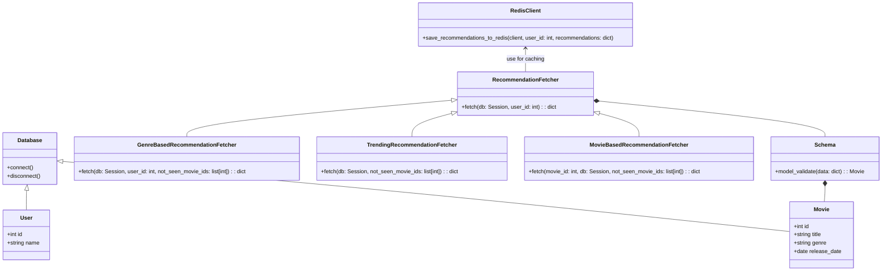

```mermaid
classDiagram
    class Database {
        +connect()
        +disconnect()
    }

    class User {
        +int id
        +string name
    }

    class Movie {
        +int id
        +string title
        +string genre
        +date release_date
    }

    class RecommendationFetcher {
        +fetch(db: Session, user_id: int): dict
    }

    class GenreBasedRecommendationFetcher {
        +fetch(db: Session, user_id: int, not_seen_movie_ids: list[int]): dict
    }

    class TrendingRecommendationFetcher {
        +fetch(db: Session, not_seen_movie_ids: list[int]): dict
    }

    class MovieBasedRecommendationFetcher {
        +fetch(movie_id: int, db: Session, not_seen_movie_ids: list[int]): dict
    }

    class Schema {
        +model_validate(data: dict): Movie
    }

    class RedisClient {
        +save_recommendations_to_redis(client, user_id: int, recommendations: dict)
    }

    Database <|-- User
    Database <|-- Movie
    RecommendationFetcher <|-- GenreBasedRecommendationFetcher
    RecommendationFetcher <|-- TrendingRecommendationFetcher
    RecommendationFetcher <|-- MovieBasedRecommendationFetcher
    Schema *-- Movie
    RecommendationFetcher *-- Schema
    RedisClient <-- RecommendationFetcher : use for caching
```
