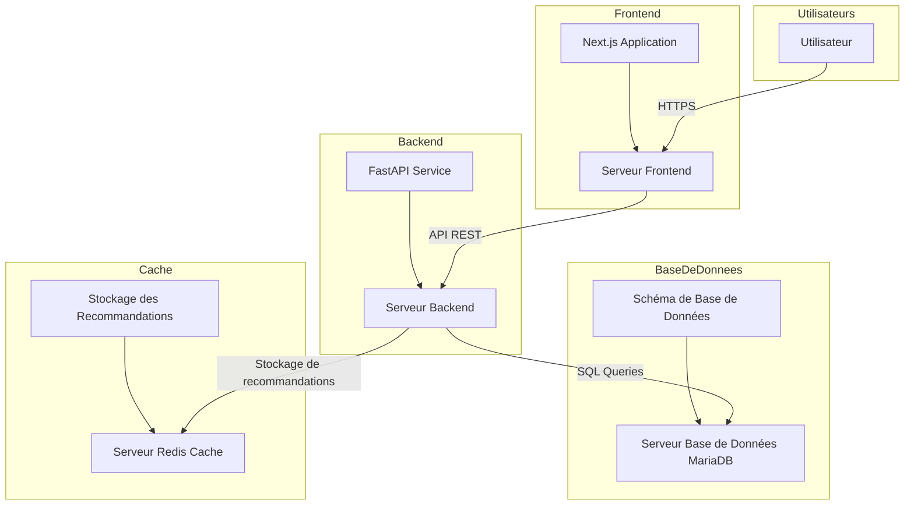

```mermaid
graph TD;
    
    subgraph Utilisateurs
    U1[Utilisateur]
    end
    
    subgraph Frontend
    F1[Serveur Frontend]
    App[Next.js Application] --> F1
    end
    
    subgraph Backend
    B1[Serveur Backend]
    API[FastAPI Service] --> B1
    end
    
    subgraph BaseDeDonnees
    D1[Serveur Base de Données MariaDB]
    Schema[Schéma de Base de Données] --> D1
    end
    
    subgraph Cache
    C1[Serveur Redis Cache]
    RecoCache[Stockage des Recommandations] --> C1
    end
    
    U1 --> |HTTPS| F1
    F1 --> |API REST| B1
    B1 --> |SQL Queries| D1
    B1 --> |Stockage de recommandations| C1
```