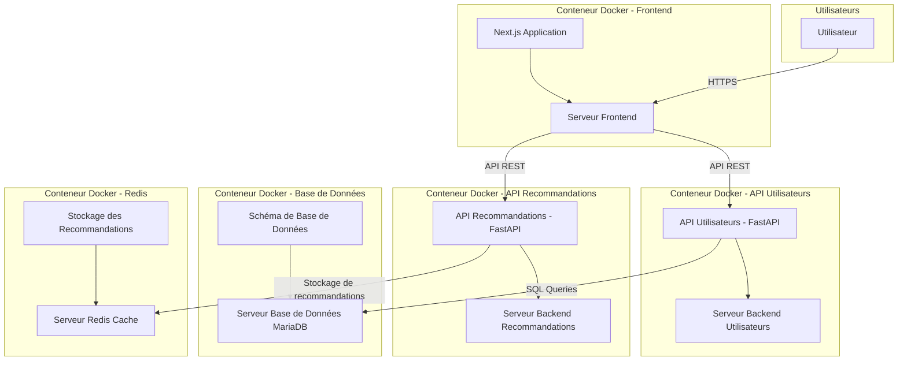

```mermaid
graph TD;

    subgraph Utilisateurs
    U1[Utilisateur]
    end

    subgraph DockerFrontEnd [Conteneur Docker - Frontend]
    F1[Serveur Frontend]
    App[Next.js Application] --> F1
    end

    subgraph DockerBackEndUsers [Conteneur Docker - API Utilisateurs]
    B1_Users[Serveur Backend Utilisateurs]
    API_Users[API Utilisateurs - FastAPI] --> B1_Users
    end

    subgraph DockerBackEndReco [Conteneur Docker - API Recommandations]
    B1_Reco[Serveur Backend Recommandations]
    API_Reco[API Recommandations - FastAPI] --> B1_Reco
    end

    subgraph DockerDB [Conteneur Docker - Base de Données]
    D1[Serveur Base de Données MariaDB]
    Schema[Schéma de Base de Données] --> D1
    end

    subgraph DockerRedis [Conteneur Docker - Redis]
    C1[Serveur Redis Cache]
    RecoCache[Stockage des Recommandations] --> C1
    end

    U1 --> |HTTPS| F1
    F1 --> |API REST| API_Users
    F1 --> |API REST| API_Reco
    API_Users --> |SQL Queries| D1
    API_Reco --> |Stockage de recommandations| C1

```