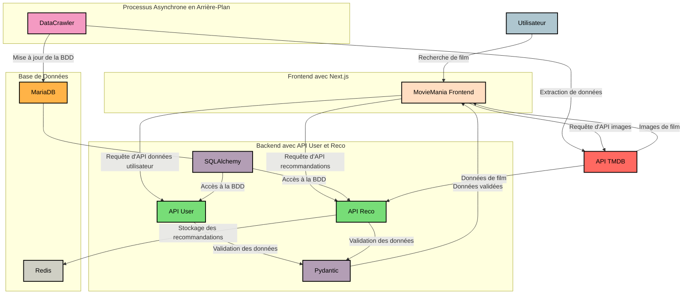

```mermaid

flowchart TD
    %% Section Frontend
    subgraph Frontend[Frontend avec Next.js]
        B[MovieMania Frontend]
    end

    %% Section Backend
    subgraph Backend[Backend avec API User et Reco]
        D[API User]
        E[API Reco]
        P[Pydantic]
        Q[SQLAlchemy]
    end

    %% Section Base de Données
    subgraph Database[Base de Données]
        R[MariaDB]
        S[Redis]
    end

    %% Section DataCrawler
    subgraph AsyncBackgroundProcess[Processus Asynchrone en Arrière-Plan]
        T[DataCrawler]

    end

    %% Acteur Externe
    A[Utilisateur]
    C[API TMDB]

    %% Interactions
    A[Utilisateur] -->|Recherche de film| B[MovieMania Frontend]
    B -->|Requête d'API données utilisateur| D[API User]
    B -->|Requête d'API recommandations| E[API Reco]
    D -->|Validation des données| P[Pydantic]
    E -->|Validation des données| P
    P -->|Données validées| B
    Q[SQLAlchemy] -->|Accès à la BDD| D
    Q -->|Accès à la BDD| E
    R[MariaDB] --- Q
    E -->|Stockage des recommandations| S
    T[DataCrawler] -->|Extraction de données| C[API TMDB]
    T -->|Mise à jour de la BDD| R
    B -->|Requête d'API images| C
    C -->|Données de film| E
    C -->|Images de film| B

    %% Légende et Définition des Styles
    classDef user fill:#AEC6CF,stroke:#000,stroke-width:2px,color:#000;
    classDef frontend fill:#FFDDC1,stroke:#000,stroke-width:2px,color:#000;
    classDef apiinternal fill:#77DD77,stroke:#000,stroke-width:2px,color:#000;
    classDef apiexternal fill:#FF6961,stroke:#000,stroke-width:2px,color:#000;
    classDef tech fill:#B39EB5,stroke:#000,stroke-width:2px,color:#000;
    classDef db fill:#FFB347,stroke:#000,stroke-width:2px,color:#000;
    classDef storage fill:#CFCFC4,stroke:#000,stroke-width:2px,color:#000;
    classDef bgprocess fill:#F49AC2,stroke:#000,stroke-width:2px,color:#000;

    %% Assignation des styles
    class A user;
    class B frontend;
    class C apiexternal;
    class D apiinternal;
    class E apiinternal;
    class P tech;
    class Q tech;
    class R db;
    class S storage;
    class T bgprocess;
```
