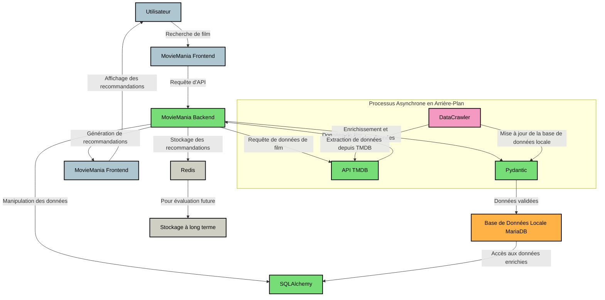

```mermaid

flowchart TD
    %% Utilisateur et Interactions Frontend
    A[Utilisateur] -->|Recherche de film| B[MovieMania Frontend]

    %% Frontend et Backend Interaction
    B -->|Requête d'API| D[MovieMania Backend]

    %% Backend et API TMDB Interaction
    D -->|Requête de données de film| C[API TMDB]
    C -->|Données de film| D

    %% Enrichissement des données
    D -->|Enrichissement et validation des données| F[Pydantic]
    F -->|Données validées| E[Base de Données Locale MariaDB]

    %% Utilisation de SQLAlchemy
    D -->|Manipulation des données| G[SQLAlchemy]
    E -->|Accès aux données enrichies| G

    %% Génération de recommandations
    D -->|Génération de recommandations| H[MovieMania Frontend]
    H -->|Affichage des recommandations| A

    %% Stockage des recommandations
    D -->|Stockage des recommandations| I[Redis]
    I -->|Pour évaluation future| J[Stockage à long terme]

    %% DataCrawler en arrière-plan
    subgraph AsyncBackgroundProcess[Processus Asynchrone en Arrière-Plan]
    K[DataCrawler] -->|Extraction de données depuis TMDB| C
    K -->|Mise à jour de la base de données locale| F
    end

    %% Légende
    classDef user fill:#AEC6CF,stroke:#000,stroke-width:2px,color:#000;
    classDef api fill:#77DD77,stroke:#000,stroke-width:2px,color:#000;
    classDef db fill:#FFB347,stroke:#000,stroke-width:2px,color:#000;
    classDef storage fill:#CFCFC4,stroke:#000,stroke-width:2px,color:#000;
    classDef bgprocess fill:#F49AC2,stroke:#000,stroke-width:2px,color:#000;

    %% Assignation des styles
    class A user;
    class B user;
    class C api;
    class D api;
    class E db;
    class F api;
    class G api;
    class H user;
    class I storage;
    class J storage;
    class K bgprocess;
```
