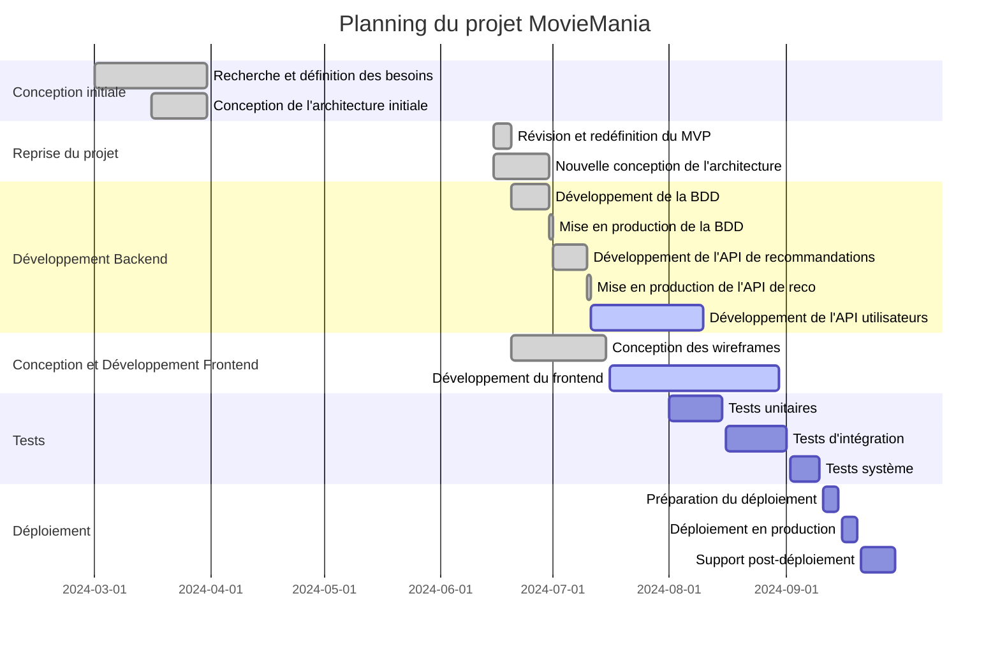

```mermaid
gantt
    title Planning du projet MovieMania
    dateFormat  YYYY-MM-DD
    section Conception initiale
    Recherche et définition des besoins       :done,    des1, 2024-03-01, 2024-03-31
    Conception de l'architecture initiale     :done,    des2, 2024-03-16, 2024-03-31

    section Reprise du projet
    Révision et redéfinition du MVP           :done,    rev1, 2024-06-15, 2024-06-20
    Nouvelle conception de l'architecture     :done,    rev2, 2024-06-15, 2024-06-30

    section Développement Backend
    Développement de la BDD                   :done,    dev1, 2024-06-20, 2024-06-30
    Mise en production de la BDD              :done,    prod1, 2024-06-30, 2024-07-01
    Développement de l'API de recommandations :done,    dev2, 2024-07-01, 2024-07-10
    Mise en production de l'API de reco       :done,    prod2, 2024-07-10, 2024-07-11
    Développement de l'API utilisateurs       :active,  dev3, 2024-07-11, 2024-08-10

    section Conception et Développement Frontend
    Conception des wireframes                 :done,    des3, 2024-06-20, 2024-07-15
    Développement du frontend                 :active,  dev4, 2024-07-16, 2024-08-30

    section Tests
    Tests unitaires                           :         test1, 2024-08-01, 2024-08-15
    Tests d'intégration                       :         test2, 2024-08-16, 2024-09-01
    Tests système                             :         test3, 2024-09-02, 2024-09-10

    section Déploiement
    Préparation du déploiement                :         dep1, 2024-09-11, 2024-09-15
    Déploiement en production                 :         dep2, 2024-09-16, 2024-09-20
    Support post-déploiement                  :         sup1, 2024-09-21, 2024-09-30

```