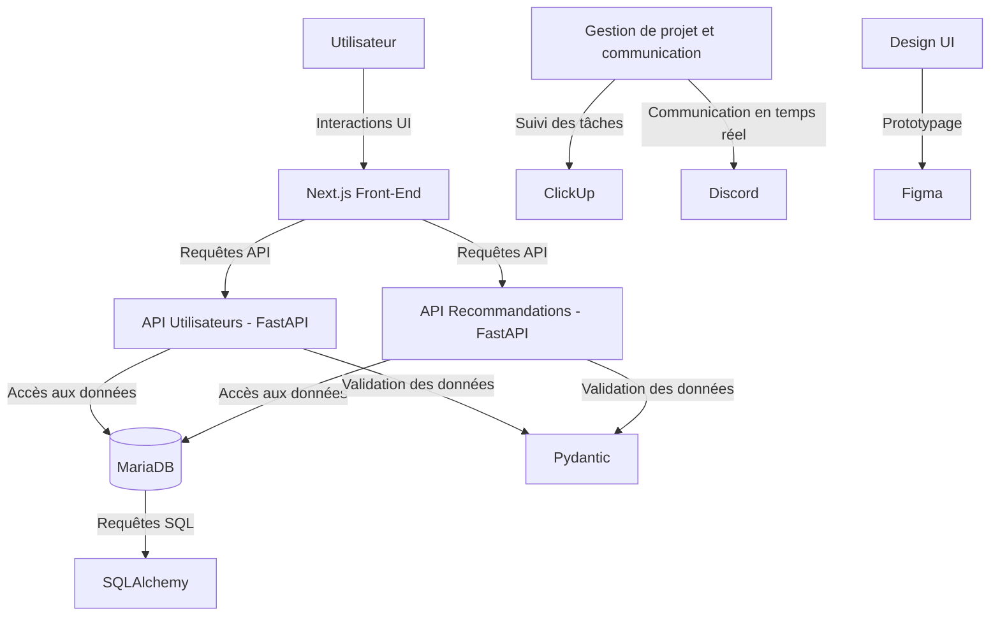

```mermaid

graph TD
    A[Utilisateur] -->|Interactions UI| B[Next.js Front-End]
    B -->|Requêtes API| C[API Utilisateurs - FastAPI]
    B -->|Requêtes API| D[API Recommandations - FastAPI]
    C -->|Accès aux données| E[(MariaDB)]
    D -->|Accès aux données| E
    C -->|Validation des données| F[Pydantic]
    D -->|Validation des données| F
    E -->|Requêtes SQL| G[SQLAlchemy]
    H[Gestion de projet et communication]
    H -->|Suivi des tâches| I[ClickUp]
    H -->|Communication en temps réel| J[Discord]
    K[Design UI]
    K -->|Prototypage| L[Figma]

```